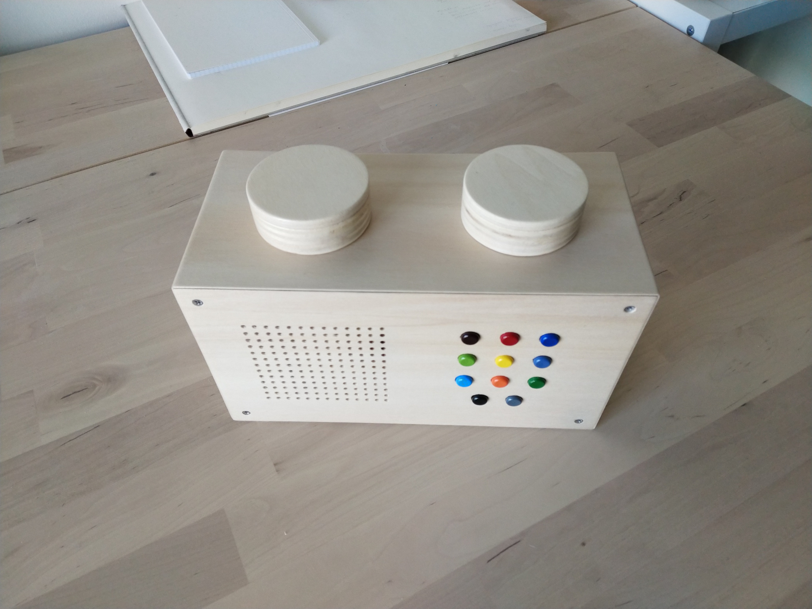
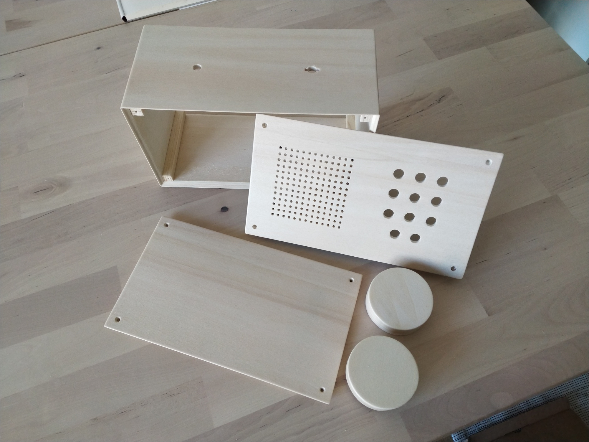
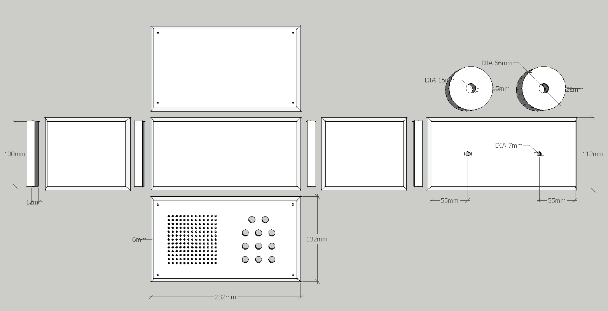
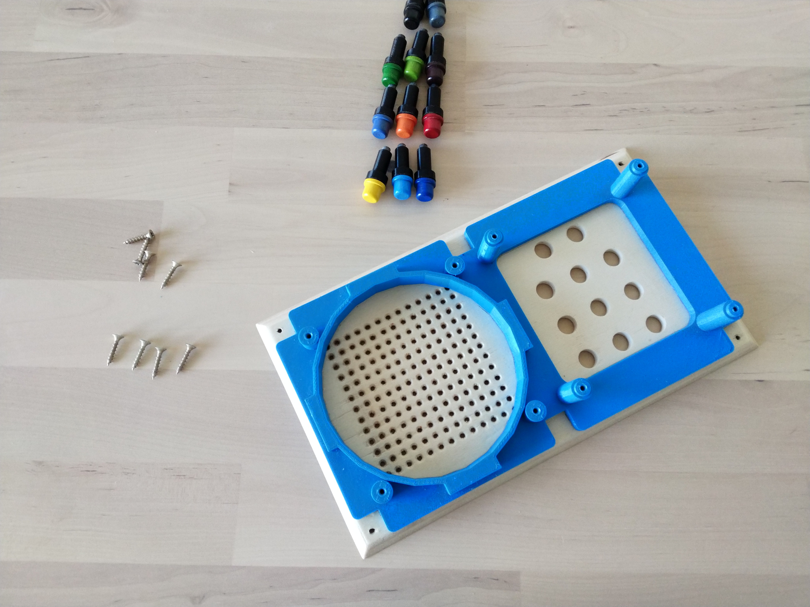
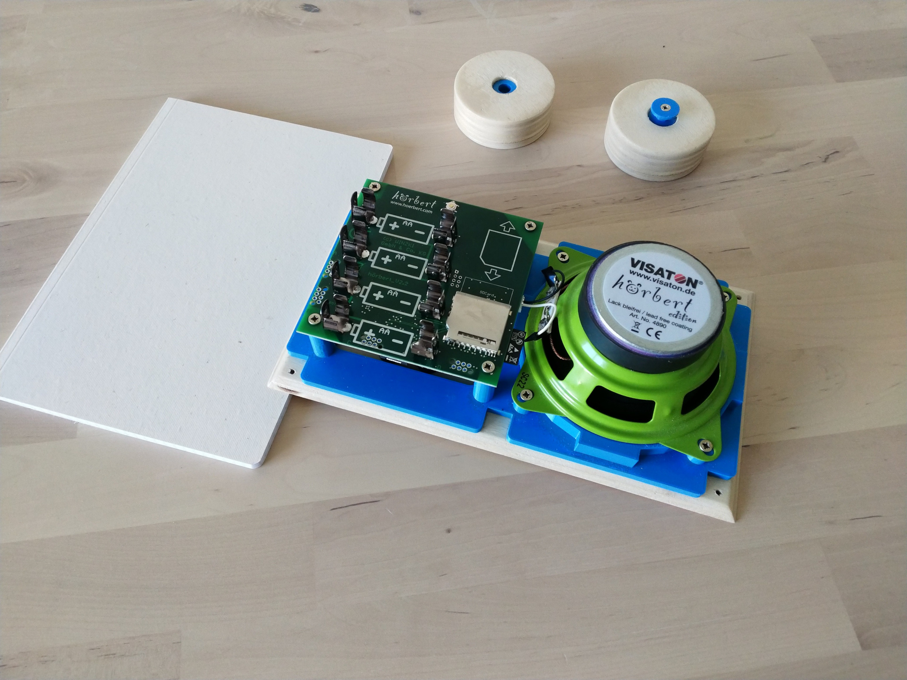

# Levibox

## Overview

This repository contains STL files for the music player my girlfriend and I built for her son. It is
based on the DIY electronics kit from Hörbert.

See: https://en.hoerbert.com/buy/hoerbert-electronics-kit-with-bluetooth-wifi-and-microphone

The music player consists of a wooden body and some 3D printed parts, which for example hold the
circuit board and speaker.

### Functionality

The right knob on top can be turned and pushed to adjusted the volume and to turn the player on/off.
The buttons on the front control what is played. Each of the nine upper buttons play one playlist.
Pressing the same button again plays the next song in the playlist. The two buttons below allow
navigation. Pressing the left button takes you back one song, pressing the right button allows you
to fast forward within a song.

(If you wonder what the left knob is for, it doesn't to anything. Because my girlfriend's son loves
LEGO, we decided to give the player the shape of a LEGO brick.)

## STL Files

- [body.stl](models/body.stl): A assembled view of the body.
- [body-explode.stl](models/body-explode.stl): An exploded view of the body, with separate parts.
- [drilling-template.stl](models/drilling-template.stl): The template for drilling holes.
- [speaker-board-holder.stl](models/speaker-board-holder.stl): The holder for the speaker and circuit board.
- [adapters.stl](models/adapters.stl): The adapters for the top knobs.

## Assembly

### Body

Finished wooden body parts:

The wooden body is made of 6mm strong wood to keep its weight low. In the edges, the body is
enforced by 12mm strong strips. If you don't have 12mm strong wood, you could also create the strips
out of two glued layers of 6mm strong wood. The same for the knobs, you can use four layers of 6mm
strong wood here.

Dimensions:

#### Cutting

The parts of the body are glued/screwed together in a 45 degree angle. I cut the body parts on a
table saw, that allowed to tilt the blade by 45 degrees, but you could also use a miter saw here.

For the knobs, I used a 68mm hole cutter and then sanded them down to 66mm with a belt sander.

#### Glueing

To glue the frame parts together, I used masking tape to hold/press everything in place.

I placed the frame parts with the outer side facing up next to each other on a table, put masking
tape over them and then turned all around. Next, I applied wood glue between the joints and folded
the frame. Afterwards, I glued the 12mm strong strips into the edges. You can also use some masking
tape here to hold them in place.

#### Drilling

For drilling the speaker and button holes you can use the template. Even with the template, I used a
punch to ensure that the holes were on the right spot. To keep the wood from splintering, I drilled
the hole from the outside. I also did a test run on a spare piece and once I was satisfied, I
drilled the "real" holes.

The holes for the speaker have a diameter of 4mm and for the buttons have a diameter of 10mm. The
holes for screwing the front/back panel to the frame have a diameter of 3mm.

Both holes for the knobs on top of the body have a diameter of 7mm. The hole where the rotary
encoder goes through needs 3mm wide cutouts. I used a small drill and a small file to make these.

#### Paint coat

To protect the body I painted the parts with clear acrylic paint. I did 3 layers with a roller and
used P320 sandpaper between coats.

### Speaker and circuit board mount

Because the circuit board is slightly raised, spacers between the circuit board and buttons are
needed. These spacers don't need to be glued on, they should hold to the buttons just by friction.

Glued on holder:

I tried different glues to glue PLA plastic to wood, "UHU Kraftkleber" worked best. As suggested, I
applied glue to holder and front panel, waited 5 minutes and then pressed both together. After two
days of drying, the two pieces were so strongly connected that I could not break them apart.

Assembled speaker and the circuit board:

The speaker and circuit board are screwed to the holder with 3x16mm countersunk cross-head screws.

(If the panel/buttons/spacers don't fit each other, adjust them with some sandpaper.)

### Top knobs

I also glued the adapters for the top knobs in with "UHU Kraftkleber". After a day of drying, they
should be firmly in place.

The rotary encoder is screwed to the body with the supplied nut. Its knob should hold on just by
friction. You should be able to press the knob to the encoder with some force. However, depending on
the accuracy of your 3D printer, the hole in the adapter might be too tight or large. If the hole is
too tight, adjust it with some sandpaper or a file. If the hole is too large, you could use some
thin adhesive tape to fix it to the encoder.

The dummy knob is screwed to the body with a 3x16mm countersunk cross-head screw.

To connect the rotary encoder, the supplied ribbon cable is too short, you will need a longer one. I
bought a 20cm long cable so that I had enough length and didn't have to bend it too much.

__Cable Type:__ AWM 20624 80C 60V VW-1, 6 Pin, 1mm Pitch

## Special Thanks

Thank you [Hörbert team](https://github.com/winzkigermany) for building such an awesome product that
has inspired this project. I also appreciate that you have released the Hörbert software for Linux
and made it Open Source! 😊

## Copyright and License

Copyright Matthias Kellnhofer. All rights reserved.

Licensed under the Apache License, Version 2.0 (the "License"); you may not use this file except in
compliance with the License. You may obtain a copy of the License at

http://www.apache.org/licenses/LICENSE-2.0

Unless required by applicable law or agreed to in writing, software distributed under the License is
distributed on an "AS IS" BASIS, WITHOUT WARRANTIES OR CONDITIONS OF ANY KIND, either express or
implied. See the License for the specific language governing permissions and limitations under the
License.